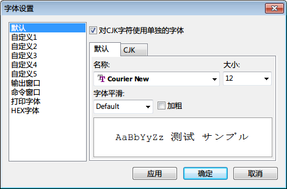

EverEdit支持等宽和非等宽字体，用户可以使用任何已经安装的字体。EverEdit还支持对中英字体分开设置，彻底解决了部分字体显示中日韩字符不太美观的问题。

##字体列表
EverEdit提供了默认+5个用户自定义字体，供用户进行切换。您可以定义多个字体以适应不同的场景，比如编程、小说阅读等等。

##字体设定

支持CJK字符设定的字体有：

* 默认
* 自定义1
* 自定义2
* 自定义3
* 自定义4
* 自定义5
* 输出字体
* 命令窗口
* 打印字体

在您为CJK字符设置专用字体时，需要先勾选上方的CJK字体支持复选框。

##使用字体
在您更改完字体，可以点击应用或者确定来生效。如果您发现当前编辑区域的字体没有生效，请检查您更改的字体是否是当前正在使用的字体。查看方法，主菜单→查看→字体，看看哪个字体被勾选了呢？

##关于字体样式
EverEdit支持字体加粗、倾斜、加粗并倾斜、下划线、波浪线、双下划线、矩形框等多种样式的设定。这些样式的使用需要语法文件的配合。具体用法请参考[语法]和[主题]设置。

**注意**：如果当前选用的字体不是等宽字体，那么该字体的加粗和倾斜特性将不会起作用。

