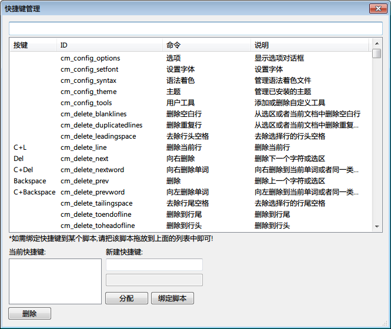

EverEdit的快捷键简单而强大，并且有着图形化的配置界面，自定义工具，脚本，菜单操作等都可以为之配置快捷键。EverEdit的快捷键同时支持多级按键。比如按下Ctrl+K之后需要在按一个键才会组成一个完整的命令。

##管理界面


###检索
在输入框中输入某个菜单命令即可显示出所有匹配的命令，检索支持中英文。

###按键绑定
在第一个按键输入中输入一个按键。如果需要绑定多级按键，则在第二个中继续输入；否则忽略即可。EverEdit的快捷键支持Ctrl,Shift,Alt,Win这4个多功能键进行绑定，可以组合出足够多个按键，供用户设定。除此之外，EverEdit还支持多媒体；一部分多媒体键盘的部分按键可以显示出来。

###绑定到脚本
扩展菜单下显示了很多EverEdit自带的脚本命令，这些脚本命令并未显示在快捷键对话框中。如需绑定快捷键到某个脚本，直接拖放该脚本到快捷键对话框，然后就可以像普通命令一样绑定快捷键了。除此之外，还可以用下方的[**绑定**]按钮，进行选择。

**注意**：在[**macro**]目录中的文件是以相对路径进行加入到EverEdit中的，这样当移动主程序时，EverEdit仍能确保各个脚本正常的工作。**推荐**您始终把脚本按照目录顺序组织到[macro]目录中。

##保存格式
EverEdit的快捷键以纯文本的方式保存在key.ini中，所以您也可以手工进行更改该文件。典型的按键如下：

```
CSA+B
```

加号之前的表示功能键.C: Control; S: Shift; A: Alt; W: Win

加号之后的按键参考如下：

```
LeftMouseButton
RightMouseButton
Control-Break
MiddleMouseButton
X1MouseButton
X2MouseButton
Undefined
Backspace
Tab
Clear
Enter
Shift
Control
Alt
Pause
CapsLock
IMEKanaMode
IMEJunjaMode
IMEFinalMode
IMEHanjaMode
Esc
IMEConvert
IMENonconvert
IMEAccept
IMEModeChange
Space
PageUp
PageDown
End
Home
Left
Up
Right
Down
Select
Print
Execute
PrintScreen
Ins
Del
Help
0
1
2
3
4
5
6
7
8
9
A
B
C
D
E
F
G
H
I
J
K
L
M
N
O
P
Q
R
S
T
U
V
W
X
Y
Z
LeftWin
RightWin
App
Sleep
Num0
Num1
Num2
Num3
Num4
Num5
Num6
Num7
Num8
Num9
Mul
Add
Separator
Sub
Decimal
Div
F1
F2
F3
F4
F5
F6
F7
F8
F9
F10
F11
F12
F13
F14
F15
F16
F17
F18
F19
F20
F21
F22
F23
F24
NumLock
ScrollLock
LeftShift
RightShift
LeftControl
RightControl
LeftAlt
RightAlt
BrowserBack
BrowserForward
BrowserRefresh
BrowserStop
BrowserSearch
BrowserFavorites
BrowserHome
VolumeMute
VolumeDown
VolumeUp
NextTrack
PreviousTrack
StopMedia
Play/PauseMedia
StartMail
SelectMedia
StartApp1
StartApp2
;
Equal
Comma
-
.
/
`
[
\\
]
'
IMEProcessKey
VK_PACKET
Attn
CrSel
ExSel
EraseEOF
Play
Zoom
PA1
Clear
```